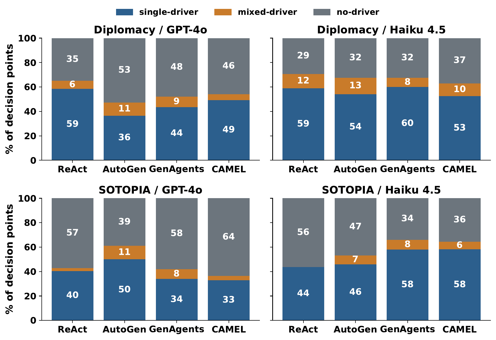

<div align="center">

# Listening Agents

**Are LLM agents actually listening to each other?**

*Per-message counterfactual attribution for multi-agent decision points*

[](https://github.com/oldblack45/listening-agents)
[](https://www.python.org)
[](LICENSE)
[](https://github.com/oldblack45/listening-agents/pulls)

</div>

---

> **40% of inter-agent messages drive nothing.**
>
> We measure which incoming message actually steers a recipient's next action — at deployment time, black-box, across **849 decision points**, **4 architectures** (ReAct, AutoGen, Generative Agents, CAMEL), **2 base models** (GPT-4o, Claude Haiku 4.5), and **2 environments** (Diplomacy, SOTOPIA).

<p align="center">
  
</p>
<p align="center"><i>Across every (environment, architecture, model) cell, decision points fall into three co-occurring regimes: <b>single-driver</b>, <b>mixed-driver</b>, and <b>no-driver</b>.</i></p>

---

## What this is

| What | How | Why |
|---|---|---|
| Per-message **counterfactual attribution** at multi-agent decision points | Pragmatic-controlled perturbation + noise-corrected `FSKL-excess` + per-DP attribution vector | Trace logs say *who spoke*; we measure *who listened* |

The framework combines three components, one per challenge:

1. **Pragmatic-controlled perturbation generator** — fixes speech act, commitment strength, addressee, and temporal marker; admits only propositional substitution. *(intervention impurity)*
2. **Noise-corrected attribution score** `FSKL-excess` — subtracts a same-temperature replicate baseline with a 1.5σ margin. *(sampling noise)*
3. **Within-DP attribution vector + driver-regime label** — scores every incoming message under fixed co-incoming context; labels each DP as `single-driver`, `mixed-driver`, or `no-driver`. *(cross-message interference)*

---

## Key findings

- **Three co-occurring regimes** — single-driver / mixed-driver / no-driver appear in *every* cell of the (environment × architecture × model) matrix
- **~40% no-driver** — across 849 DPs, the recipient's action depends on no single incoming message
- **Half of mixed-driver DPs are competing** — two top senders push the recipient in opposing directions
- **Robust** to noise margin (1.0σ–2.0σ), dominance ratio (1.5–3.0), MASK-LOO ablation, and operator swap (fact-replace vs counterfactual)

---

## Quick start

<details open>
<summary><b>Installation</b></summary>

```bash
git clone https://github.com/oldblack45/listening-agents
cd listening-agents
python -m venv .venv && source .venv/bin/activate    # Windows: .venv\Scripts\activate
pip install -r requirements.txt
```

Tested with Python 3.10 / 3.11.
</details>

<details>
<summary><b>Configuration</b></summary>

The runner talks to any OpenAI-compatible endpoint:

```bash
export OPENAI_API_BASE="https://api.openai.com/v1"     # or your gateway
export OPENAI_API_KEY="sk-..."

# Defaults shown
export AGENT_MODEL="gpt-4o-2024-08-06"
export JUDGE_MODEL="gpt-4o-2024-08-06"
export JUDGE_FALLBACK="gpt-4o-2024-08-06"
```

For the Claude Haiku 4.5 row, point the same variables at an Anthropic-compatible gateway and set `AGENT_MODEL=claude-haiku-4-5`.
</details>

<details>
<summary><b>Smoke test (~1 minute)</b></summary>

```bash
PILOT_FAST=1 python -m scripts.run_v4
```
</details>

<details>
<summary><b>Reproduce the paper (~day at concurrency 16)</b></summary>

```bash
# Main sweeps
python -m scripts.run_v4               # Diplomacy, 4 archs x 4 operators
python -m scripts.run_v4_sotopia       # SOTOPIA equivalent

# Apply per-DP regime label (paper Eq. 11)
python -m scripts.classify_driver_structure
python -m scripts.analyze_v5
python -m scripts.analyze_sotopia_v5

# Sub-regime refinements (Section 5.2)
python -m scripts.run_e2_allmask_v2    # no-driver -> autonomous / diffuse
python -m scripts.run_e3_pairwise      # mixed-driver -> additive / competing / redundant

# MASK-LOO ablation (Table 1, bottom row)
python -m scripts.run_mask_loo
python -m scripts.analyze_ablation

# Figures
python -m scripts.make_fig_calibration         # Fig. 3
python -m scripts.make_figs_modeshare          # Fig. 4
python -m scripts.make_fig_anatomy             # Fig. 5
python -m scripts.make_fig_cases               # Section 5.4 boxes
```

The SQLite LLM cache makes every step resumable.
</details>

---

## Repository layout

```
src/
  agents/             ReAct, AutoGen, GenAgents, CAMEL adapters
  slot_generator/     Pragmatic 4-tuple extractor + intervener + Eq. 3 gate
  env_adapter.py      Diplomacy press environment wrapper
  sotopia_env.py      SOTOPIA social environment wrapper
  runner_v4.py        Per-DP runner for Diplomacy
  runner_v4_sotopia.py  Per-DP runner for SOTOPIA
  llm_client.py       Cached OpenAI-compatible chat client
  metrics.py          FSKL-excess and noise-baseline KL
  analysis.py         Cell-level metric aggregation
  config.py           Sweep matrix + thresholds (Eq. 3, sigma margin)
scripts/              Reproduction scripts grouped above
data/                 Created at runtime (see data/README.md)
docs/                 Repository assets
```

---

## Status

- [x] Pragmatic 4-tuple extractor (Φ) with deterministic acceptance gate (BLEU ≥ 0.3, SBERT cos ≥ 0.6, Φ-equality)
- [x] Fact-replace and counterfactual operators
- [x] FSKL-excess + same-τ noise baseline with σ-margin
- [x] Driver-regime classifier (single / mixed / no-driver)
- [x] No-driver refinement (autonomous vs diffuse)
- [x] Mixed-driver refinement (additive / competing / redundant)
- [x] MASK-LOO ablation
- [ ] Cross-turn propagated effects *(future work)*
- [ ] Larger reproducible sub-regime samples *(future work)*

---

## License

MIT. See [LICENSE](LICENSE).
